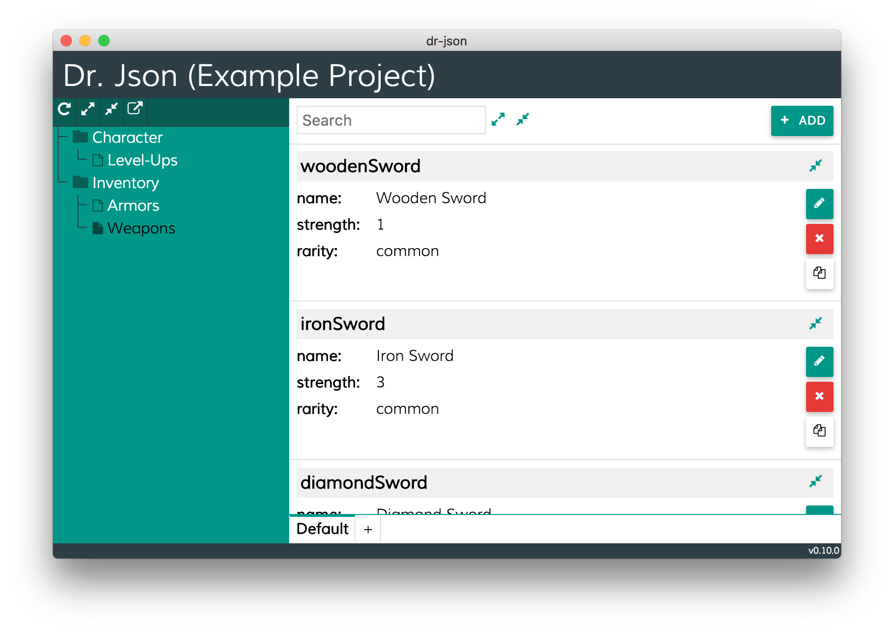

# What is Dr. Json?

It's a native application for Win/iOS that gives you the possibility to manage JSON files based on JSON Schemas.

# Download

1. Download [the latest version here](https://github.com/innogames/dr-json/releases).
2. Extract (unzip) the downloaded file and execute it.

# Documentation

- [User documentation (How to use this app)](./docs/user-documentation.md).
- [Developer documentation](./docs/developer-documentation.md).
