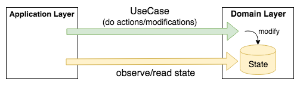
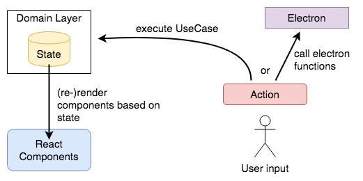

# The architecture

The code of Dr. Json is divided in two main layers. **Domain layer** and **Application layer**.
You can find them in the folder structure as well:

```text
dr-json/
  └─ src/
       ├─ app/               ← The application layer
       │    ├─ main/
       │    ├─ renderer/
       │    └─ shared/
       │
       └─ domain/            ← The domain layer
            ├─ useCases/
            ├─ states/
            └─ ...
```

## Domain Layer

The domain layer is completely encapsulated and only contains **business logic**.
It doesn't know the environment (Which means it doesn't even know that it's an Electron App).

The main **entry points** into the domain layer are so called "[Use Cases](../../src/domain/useCases)".
**Each action** the user can do is represented by a UseCase class.
Use Cases are executed asynchronously and just return a `Promise<void>`. Internally they change the application state.

The application **state** consists of observable objects (using [MobX](https://mobx.js.org)) and contains all information about the current state
(like current project, opened file and entries, UI states, etc.).
Everyone can subscribe and get notified when the state changes.




## Application Layer

The application layer knows the environment and delegates to the domain layer to execute business logic.

Because it's an [Electron](https://electronjs.org/) app we have a "main" and a "renderer" process.
Both are located in their own folder:

```
app/
 ├─ main/      ← Code for main process
 ├─ renderer/  ← Code for renderer process
 └─ shared/    ← Code which can be used by both (main/renderer) processes
```

The renderer process used [React](https://reactjs.org/) and [MobX](https://mobx.js.org) to render all
components based on the application state (the state of the domain layer).

On user input, the application layer executes a UseCase from the domain layer which changes the state.
The React components observe the state and automatically re-render when the state changes.

