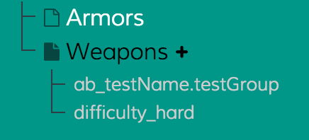

# File variants

Depending on your project you might need to have different variants of the same JSON file
(For example if you do an A/B Test or you have a game with different configs for normal and hard mode).
In this case you can define different types of variants in your project file like this:

```json
{
  "name": "My Project",
  "variantTypes": [
    {
      "name": "AB Test",
      "variantId": "ab_{testName}.{testGroup}",
      "vars": {
        "testName": {
          "title": "Test Name",
          "type": "string"
        },
        "testGroup": {
          "title": "Test Group",
          "type": "string"
        }
      }
    },
    {
      "name": "Hard Mode",
      "variantId": "hard",
      "vars": {}
    }
  ]
}
```

In this example you can see two variant types. "AB Test" and "Hard Mode".



In Dr. Json you can see the variants in the file tree when you select a file which contains variants.
You can also find a `+` next to the file. By clicking on the plus you can
create a new variant for the current selected file. There you will get a form where you can choose between the 
variant types configured above.

If a variant type contains `vars` you need to fill out those in the form as well
(e.g. "Test Name" and "Test Group" for the "AB Test" variant).
On submit, Dr. Json creates a **variantId** based on your provided input and stores the data of that variant in
the directory "variantTypes/\<variantId\>/\<yourFile\>.json"
(You can specify another directory in the project file, if you want).
 
> Example: You have a JSON file called _enemies.json_. You create a new AB Test variant for this file with
> "exp" as the test name and "more_exp" as the test group. This will create the variantId "ab_exp.more_exp" and store 
> the data into _variantTypes/ab_exp.more_exp/enemies.json_.

With Dr. Json you only create and manage the variant files. How they are handled/merged depends on your project and is
not part of Dr. Json.
